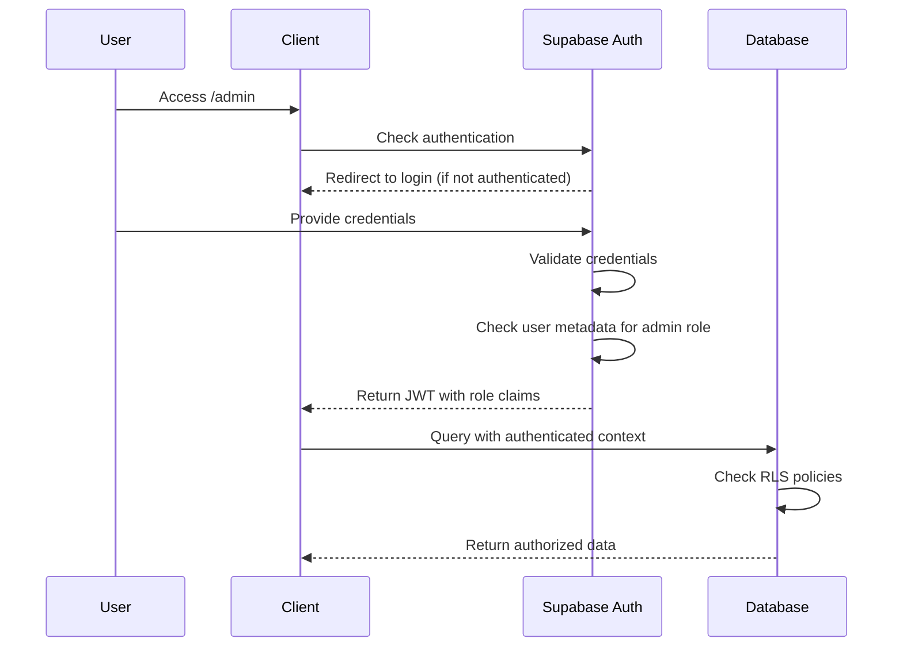

# Architecture Guide

## System Overview

The Dutch Bottle Collect Checker is a modern web application built with a React frontend and Supabase backend, designed to help users find supermarket locations for bottle return services across the Netherlands.

## Technology Stack

### Frontend Architecture

**Core Framework**
- **React 18** - Component-based UI framework
- **TypeScript** - Type-safe JavaScript development
- **Vite** - Fast build tool and development server

**UI & Styling**
- **Tailwind CSS** - Utility-first CSS framework
- **shadcn/ui** - Pre-built accessible component library
- **Responsive Design** - Mobile-first approach

**State Management**
- **TanStack Query** - Server state management and caching
- **React Hooks** - Local state management
- **Context API** - Global state sharing

**Maps & Location**
- **Google Maps React API** - Interactive map component for frontend display
- **Google Places API** - Location data and search (server-side sync only)

### Backend Architecture

**Database & API**
- **Supabase** - Backend-as-a-Service platform
- **PostgreSQL** - Relational database with real-time features
- **Row Level Security (RLS)** - Database-level access control
- **Real-time subscriptions** - Live data updates

**Authentication**
- **Supabase Auth** - User authentication and session management
- **Role-based access control** - Admin vs regular user permissions
- **JWT tokens** - Secure authentication flow

## Application Architecture

### Component Hierarchy

```
App (Router)
├── Pages/
│   ├── Index (Main Application)
│   │   ├── SearchBar
│   │   ├── Map (Google Maps)
│   │   └── SupermarketCard[]
│   │       ├── IncidentReportDialog
│   │       └── IncidentSearchDialog
│   ├── Admin (Dashboard)
│   │   └── AdminDashboard
│   │       ├── IncidentManagement
│   │       └── SupermarketOverview
│   └── NotFound (404)
└── Global Components/
    ├── Toast Notifications
    └── Loading States
```

### Service Layer Design

**Data Services**
- `databaseService.ts` - Supabase integration and real-time subscriptions
- `placesService.ts` - Cache management and data file loading (no direct API calls)

**Custom Hooks**
- `useSupermarkets.ts` - Database-first data management with intelligent fallbacks
- `use-toast.ts` - Notification management

**Utility Libraries**
- `supabase.ts` - Supabase client configuration
- `utils.ts` - Shared utility functions

## Database Schema Design

### Core Tables

#### `supermarkets`
```sql
CREATE TABLE supermarkets (
    id UUID PRIMARY KEY DEFAULT gen_random_uuid(),
    google_place_id TEXT UNIQUE NOT NULL,
    name TEXT NOT NULL,
    address TEXT NOT NULL,
    latitude DOUBLE PRECISION NOT NULL,
    longitude DOUBLE PRECISION NOT NULL,
    status TEXT DEFAULT 'unknown' CHECK (status IN ('open', 'closed', 'unknown')),
    chain TEXT,
    phone TEXT,
    website TEXT,
    lastUpdated TIMESTAMP WITH TIME ZONE DEFAULT NOW()
);
```

#### `supermarket_incidents`
```sql
CREATE TABLE supermarket_incidents (
    id UUID PRIMARY KEY DEFAULT gen_random_uuid(),
    supermarket_id UUID REFERENCES supermarkets(id) ON DELETE CASCADE,
    type TEXT NOT NULL CHECK (type IN ('machine_broken', 'machine_full', 'no_bottles_accepted', 'other')),
    description TEXT,
    priority TEXT DEFAULT 'medium' CHECK (priority IN ('low', 'medium', 'high')),
    status TEXT DEFAULT 'open' CHECK (status IN ('open', 'investigating', 'resolved', 'closed')),
    reportedAt TIMESTAMP WITH TIME ZONE DEFAULT NOW(),
    reporterEmail TEXT,
    adminNotes TEXT,
    resolvedAt TIMESTAMP WITH TIME ZONE
);
```

#### `sync_metadata`
```sql
CREATE TABLE sync_metadata (
    id UUID PRIMARY KEY DEFAULT gen_random_uuid(),
    operation TEXT NOT NULL,
    lastSync TIMESTAMP WITH TIME ZONE DEFAULT NOW(),
    status TEXT DEFAULT 'success',
    errorMessage TEXT,
    recordsProcessed INTEGER DEFAULT 0
);
```

### Database Functions

#### Admin Functions
```sql
-- Get dashboard statistics
CREATE OR REPLACE FUNCTION get_admin_dashboard_stats()
RETURNS JSON AS $$
-- Returns comprehensive dashboard metrics
$$;

-- Bulk resolve incidents
CREATE OR REPLACE FUNCTION bulk_resolve_incidents(
    incident_ids UUID[],
    admin_notes TEXT DEFAULT NULL
) RETURNS INTEGER AS $$
-- Resolves multiple incidents in a single operation
$$;
```

#### Views
```sql
-- Supermarket incident summary
CREATE VIEW supermarket_incident_summary AS
SELECT 
    s.id,
    s.name,
    s.address,
    COUNT(si.id) as total_incidents,
    COUNT(si.id) FILTER (WHERE si.status IN ('open', 'investigating')) as active_incidents,
    MAX(si.reportedAt) as latest_incident
FROM supermarkets s
LEFT JOIN supermarket_incidents si ON s.id = si.supermarket_id
GROUP BY s.id, s.name, s.address;
```

### Row Level Security (RLS)

**Supermarket Access**
```sql
-- Public read access
CREATE POLICY "Public can view supermarkets" 
ON supermarkets FOR SELECT 
TO PUBLIC 
USING (true);

-- Admin write access
CREATE POLICY "Admins can manage supermarkets" 
ON supermarkets FOR ALL 
TO authenticated 
USING (auth.jwt() ->> 'role' = 'supermarket_admin');
```

**Incident Management**
```sql
-- Public can create incidents
CREATE POLICY "Anyone can report incidents" 
ON supermarket_incidents FOR INSERT 
TO PUBLIC 
WITH CHECK (true);

-- Admin full access
CREATE POLICY "Admins can manage incidents" 
ON supermarket_incidents FOR ALL 
TO authenticated 
USING (auth.jwt() ->> 'role' = 'supermarket_admin');
```

## Real-time Data Flow

### Data Synchronization Strategy

**Primary Data Sources**
1. **Database** (Primary) - Supabase PostgreSQL with real-time updates
2. **Static Data Files** (Fallback) - Pre-synced JSON files for development
3. **Mock Data** (Development) - Built-in demo data for testing

**Sync Architecture**
The Google Places API integration operates as a backend synchronization process rather than real-time client-side calls. This approach provides better cost control, rate limiting, and performance.

- **Manual Sync**: Server-side scripts fetch and process data from Google Places API
- **Scheduled Updates**: Can be automated via GitHub Actions or cron jobs
- **Data Processing**: Server handles deduplication, geocoding validation, and status determination
- **Database Population**: Processed data is inserted/updated in Supabase PostgreSQL

**Real-time Features**
- **Live incident updates** - New reports appear immediately via Supabase real-time
- **Status changes** - Admin updates reflected instantly across all clients
- **Map updates** - Marker states change in real-time through database subscriptions

### Caching Strategy

**Frontend Caching**
- **TanStack Query** - 5-minute cache for database queries with automatic invalidation
- **LocalStorage** - 24-hour cache for supermarket data to improve load times
- **React Query Deduplication** - Prevents duplicate network requests

**Backend Optimization**
- **Connection pooling** - Efficient database connections via Supabase
- **Query optimization** - Indexed searches and optimized joins
- **Batch operations** - Efficient bulk updates during sync operations

## State Management Patterns

### Client State Architecture

The application uses a data-fetching strategy that prioritizes database content with intelligent fallbacks, managed through custom hooks that abstract the complexity from UI components.

**Data Flow Pattern**
The `useSupermarkets` hook (see `src/hooks/useSupermarkets.ts`) implements a database-first approach:
1. Component mounts → Custom hook called
2. Hook checks TanStack Query cache → Returns cached data if fresh
3. Cache stale → Fetch from Supabase database
4. Database unavailable → Fallback to static data files
5. All sources unavailable → Return mock data for development
6. Real-time updates → Database subscriptions invalidate cache, trigger automatic refetch

**State Management Principles**
- **Single Source of Truth**: Database acts as the authoritative data source
- **Optimistic Updates**: UI updates immediately for better user experience, with rollback on errors
- **Cache Invalidation**: Strategic cache clearing ensures data consistency
- **Error Boundaries**: Graceful degradation when data sources are unavailable

### Server State Synchronization

**Optimistic UI Updates**
For user-facing operations like incident reporting, the application implements optimistic updates through TanStack Query mutations. The pattern involves:
- Immediate UI feedback by updating local cache
- Background API call to persist changes
- Automatic rollback if the operation fails
- Cache invalidation and refetch to ensure consistency

Implementation details can be found in the database service (`src/services/databaseService.ts`) and the incident reporting components.

## Security Architecture

### Authentication Flow



### Access Control Matrix

| Resource | Public | Authenticated | Admin |
|----------|--------|---------------|-------|
| View supermarkets | ✅ | ✅ | ✅ |
| Report incidents | ✅ | ✅ | ✅ |
| View incident summary | ✅ | ✅ | ✅ |
| Manage incidents | ❌ | ❌ | ✅ |
| Admin dashboard | ❌ | ❌ | ✅ |
| Bulk operations | ❌ | ❌ | ✅ |
| Database sync | ❌ | ❌ | ✅ |

### Security Best Practices

**Database Security**
- Row Level Security (RLS) enforced on all tables
- Service role key used only for server-side operations
- Anon key for client-side with limited permissions

**API Security**
- Google Places API key restricted to specific domains
- Rate limiting implemented in sync scripts
- Environment variables for all sensitive data

**Client Security**
- No sensitive data stored in browser
- JWT tokens with short expiration
- Admin role validation on every request

## Performance Considerations

### Frontend Optimization

**Bundle Optimization**
- Code splitting with React.lazy()
- Tree shaking for unused code elimination
- Dynamic imports for heavy components

**Rendering Performance**
- React.memo for expensive components
- useMemo for expensive calculations
- useCallback for stable function references

**Map Performance**
- Marker clustering for large datasets
- Viewport-based rendering
- Efficient marker updates

### Backend Optimization

**Database Performance**
- Proper indexing on frequently queried columns
- Optimized joins and aggregations
- Connection pooling

**API Efficiency**
- Smart caching strategies
- Batch operations where possible
- Rate limiting to prevent abuse

## Deployment Architecture

### Development Environment
```
Local Machine
├── React Dev Server (Vite) :5173
├── Local Supabase Stack
│   ├── PostgreSQL :54322
│   ├── API Gateway :54321
│   ├── Studio :54323
│   └── Realtime :54324
└── Node.js Sync Scripts (Manual execution)
```

### Production Environment
```
Cloud Infrastructure
├── Static Hosting (Vercel/Netlify)
│   └── React Build (SPA)
├── Supabase Cloud
│   ├── Managed PostgreSQL
│   ├── Edge Functions
│   ├── Real-time Engine
│   └── Authentication
└── Scheduled Sync (Manual/GitHub Actions)
    └── Google Places API Sync Scripts
```

## Monitoring & Observability

### Application Metrics
- **User engagement** - Page views, search queries, incident reports
- **Performance** - Load times, API response times, error rates
- **Map usage** - Zoom levels, marker interactions, search patterns

### System Health
- **Database performance** - Query times, connection counts, error rates
- **API usage** - Google Places API quota usage, rate limiting
- **Sync operations** - Success rates, data freshness, error tracking

### Error Handling
- **Client errors** - React error boundaries, toast notifications
- **API errors** - Graceful degradation, fallback data sources
- **Database errors** - Connection retry logic, transaction rollbacks